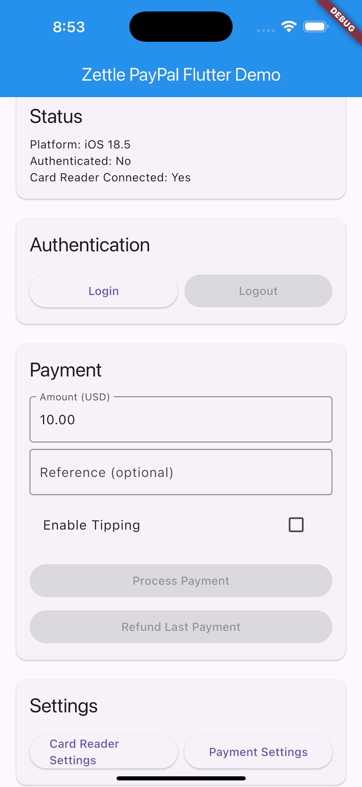

# Zettle PayPal Flutter Plugin

A Flutter plugin for integrating Zettle (PayPal) iOS SDK, enabling payment processing and card reader functionality in Flutter applications.

## Features

- 🔐 **Authentication**: Login/logout with Zettle OAuth
- 💳 **Card Payments**: Process card payments with optional tipping
- 💰 **Refunds**: Handle refund transactions
- 📱 **Card Reader Management**: Connect and manage Zettle card readers
- ⚙️ **Settings**: Access payment and card reader settings
- 🧾 **Transaction History**: Retrieve last payment information

## Platform Support

| Platform | Supported |
| -------- | --------- |
| iOS      | ✅         |
| Android  | ❌         |

## Prerequisites

- Flutter SDK 3.3.0 or higher
- iOS 12.0 or higher
- Valid Zettle developer account and API credentials

**Note**: The Zettle iOS SDK frameworks are included with this plugin - no manual SDK installation required!

## Installation

Add this to your package's `pubspec.yaml` file:

```yaml
dependencies:
  zettle_paypal_flutter: ^0.0.1
```

## Setup

### iOS Setup

The Zettle iOS SDK is automatically included with this plugin, so no manual framework installation is required.

1. **Update your iOS Info.plist:**
   Add the following permissions and configurations:

```xml
<!-- Bluetooth permissions for card readers -->
<key>NSBluetoothAlwaysUsageDescription</key>
<string>This app uses bluetooth to connect with Zettle card readers for payment processing.</string>
<key>NSBluetoothPeripheralUsageDescription</key>
<string>This app uses bluetooth to connect with Zettle card readers for payment processing.</string>

<!-- Location permissions (required by Zettle SDK) -->
<key>NSLocationWhenInUseUsageDescription</key>
<string>Location access is required for payment processing compliance.</string>

<!-- Background modes for card reader connectivity -->
<key>UIBackgroundModes</key>
<array>
    <string>bluetooth-central</string>
    <string>external-accessory</string>
</array>

<!-- External accessory protocol for Zettle card readers -->
<key>UISupportedExternalAccessoryProtocols</key>
<array>
    <string>com.izettle.cardreader-one</string>
</array>

<!-- URL scheme for OAuth authentication -->
<key>CFBundleURLTypes</key>
<array>
    <dict>
        <key>CFBundleURLName</key>
        <string>com.yourcompany.yourapp</string>
        <key>CFBundleURLSchemes</key>
        <array>
            <string>your-app-scheme</string>
        </array>
    </dict>
</array>
```

2. **Configure your iOS project:**
   - Ensure deployment target is iOS 12.0 or higher
   - The Zettle SDK frameworks are automatically linked via CocoaPods

## Usage

### Basic Setup

```dart
import 'package:zettle_paypal_flutter/zettle_paypal_flutter.dart';

class PaymentService {
  final _zettle = ZettlePaypalFlutter();

  Future<void> initialize() async {
    try {
      await _zettle.initialize();
      print('Zettle SDK initialized successfully');
    } catch (e) {
      print('Failed to initialize Zettle SDK: $e');
    }
  }
}
```

### Authentication

```dart
// Check authentication status
final isAuthenticated = await _zettle.isAuthenticated();

if (!isAuthenticated) {
  // Authenticate with Zettle
  try {
    await _zettle.authenticate();
    print('Authentication successful');
  } on ZettleAuthenticationException catch (e) {
    print('Authentication failed: $e');
  }
}

// Logout
await _zettle.logout();
```

### Processing Payments

```dart
try {
  final paymentInfo = ZettleCardPaymentInfo(
    amount: ZettleAmount(amount: 25.99, currencyCode: 'USD'),
    reference: 'ORDER-123',
    enableTipping: true,
  );

  final result = await _zettle.chargeCard(paymentInfo);
  
  print('Payment successful!');
  print('Amount: ${result.amount.amount} ${result.amount.currencyCode}');
  print('Card: ${result.cardBrand}');
  print('Reference: ${result.reference}');
  
} on ZettlePaymentCancelledException {
  print('Payment was cancelled by user');
} on ZettlePaymentFailedException catch (e) {
  print('Payment failed: $e');
} on ZettleNotAuthenticatedException {
  print('Please authenticate first');
}
```

### Processing Refunds

```dart
try {
  final refundInfo = ZettleRefundInfo(
    amount: ZettleAmount(amount: 25.99, currencyCode: 'USD'),
    reference: 'REFUND-ORDER-123',
  );

  final result = await _zettle.refund(refundInfo);
  print('Refund successful: ${result.amount.amount} ${result.amount.currencyCode}');
  
} on ZettleRefundFailedException catch (e) {
  print('Refund failed: $e');
}
```

### Card Reader Management

```dart
// Check card reader connection
final isConnected = await _zettle.isCardReaderConnected();
print('Card reader connected: $isConnected');

// Show card reader settings
await _zettle.showCardReaderSettings();
```

## API Reference

### Core Classes

#### `ZettlePaypalFlutter`
Main plugin class providing access to all Zettle SDK functionality.

#### `ZettleAmount`
Represents a monetary amount with currency.
```dart
final amount = ZettleAmount(amount: 10.50, currencyCode: 'USD');
```

#### `ZettleCardPaymentInfo`
Payment information for card transactions.
```dart
final paymentInfo = ZettleCardPaymentInfo(
  amount: ZettleAmount(amount: 10.50, currencyCode: 'USD'),
  reference: 'ORDER-123',
  enableTipping: true,
);
```

#### `ZettlePaymentResult`
Result of a successful payment transaction.

#### `ZettleRefundInfo`
Information for refund transactions.

#### `ZettleRefundResult`
Result of a successful refund transaction.

### Exceptions

- `ZettleNotAuthenticatedException`: SDK is not authenticated
- `ZettlePaymentCancelledException`: Payment was cancelled by user
- `ZettlePaymentFailedException`: Payment processing failed
- `ZettleRefundFailedException`: Refund processing failed
- `ZettleCardReaderException`: Card reader connectivity issues
- `ZettleAuthenticationException`: Authentication failed
- `ZettleInvalidParameterException`: Invalid parameters provided
- `ZettleNetworkException`: Network connectivity issues

## Example App




The example app demonstrates all plugin features:

1. **Authentication flow**: Login/logout functionality
2. **Payment processing**: Card payments with customizable amounts
3. **Refund handling**: Refund last payment
4. **Settings access**: Card reader and payment settings
5. **Status monitoring**: Authentication and card reader status

To run the example app:

```bash
cd example
flutter run
```

## Development Notes

### Current Implementation Status

This plugin currently includes:
- ✅ Complete Dart API with comprehensive models and exceptions
- ✅ iOS platform implementation structure (with mock responses)
- ✅ Comprehensive example application
- ⚠️ **Note**: The iOS implementation uses mock responses for demonstration

### Integrating the Actual Zettle SDK

To integrate with the real Zettle iOS SDK:

1. **Add the Zettle SDK frameworks** to `ios/iZettleSDK/Frameworks/`:
   - Copy `iZettleSDK.xcframework` to the Frameworks directory
   - Copy `iZettlePayments.xcframework` to the Frameworks directory  
   - Copy `PPRiskMagnes.xcframework` to the Frameworks directory
   - Copy the corresponding `.dSYM` files for debugging symbols

2. **Uncomment and implement** the actual SDK calls in `ios/Classes/ZettlePaypalFlutterPlugin.swift`
3. **Configure OAuth credentials** in your iOS project
4. **Test with actual Zettle card readers**

### Required iOS SDK Integration Steps

1. Import the Zettle SDK in the Swift plugin file:
```swift
import iZettleSDK
```

2. Initialize the SDK with your credentials:
```swift
iZettleSDK.shared().start(with: iZettleSDKAuthorizationProviderPublicKey(clientID: "YOUR_CLIENT_ID"))
```

3. Replace mock implementations with actual SDK calls throughout the plugin.

## Contributing

Contributions are welcome! Please feel free to submit a Pull Request.

## License

This project is licensed under the MIT License - see the [LICENSE](LICENSE) file for details.

## Support

For issues related to:
- **Plugin functionality**: Create an issue in this repository
- **Zettle SDK**: Contact [Zettle Developer Support](https://ext-izettle.atlassian.net/servicedesk/customer/portal/3)
- **Flutter development**: Check the [Flutter documentation](https://flutter.dev/docs)

## Acknowledgments

- Built on top of the [Zettle iOS SDK](https://developer.zettle.com/docs/payment-integrations/ios-sdk)
- Inspired by the need for Flutter integration with Zettle payment solutions

